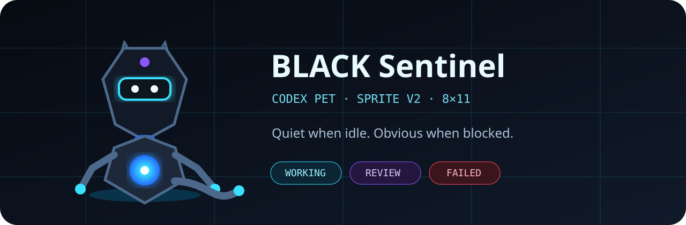

# BLACK Sentinel — Codex Pet

A custom **Codex V2 pet** for BLACK Code. It is a compact cyber sentinel rather than a decorative mascot: every animation makes the current agent state readable at a glance.



## Design

- **Silhouette:** small black fox-drone / sentinel
- **Primary signal:** cyan chest core and visor
- **Waiting:** orbiting hourglass
- **Working:** holographic keyboard
- **Review:** violet inspection lens
- **Failure:** red core and fragmented pixels
- **Atlas:** transparent indexed PNG, `1536 × 2288`, `8 × 11`
- **Frames:** 88
- **Size:** 171,770 bytes
- **SHA-256:** `f7a5a2cf2d1995590720024d1738bb916fc80255dbea8be4e058fa249c6a7ed3`

## Install on Windows

```powershell
Set-ExecutionPolicy -Scope Process Bypass
.\install.ps1
```

The installer writes to `$env:CODEX_HOME\pets\black-sentinel` when `CODEX_HOME` exists, otherwise to `$HOME\.codex\pets\black-sentinel`.

## Install on macOS / Linux

```bash
chmod +x install.sh
./install.sh
```

Restart Codex, open the custom pet selector, and choose **BLACK Sentinel**.

## Regenerate and validate

```bash
python -m pip install -r requirements.txt
python generate_spritesheet.py
python verify.py
```

The generator is deterministic under the pinned Pillow version. CI rebuilds the atlas, verifies all 88 cells, and rejects checksum or manifest drift.

See [STATE_MAP.md](STATE_MAP.md) for the complete animation contract.
